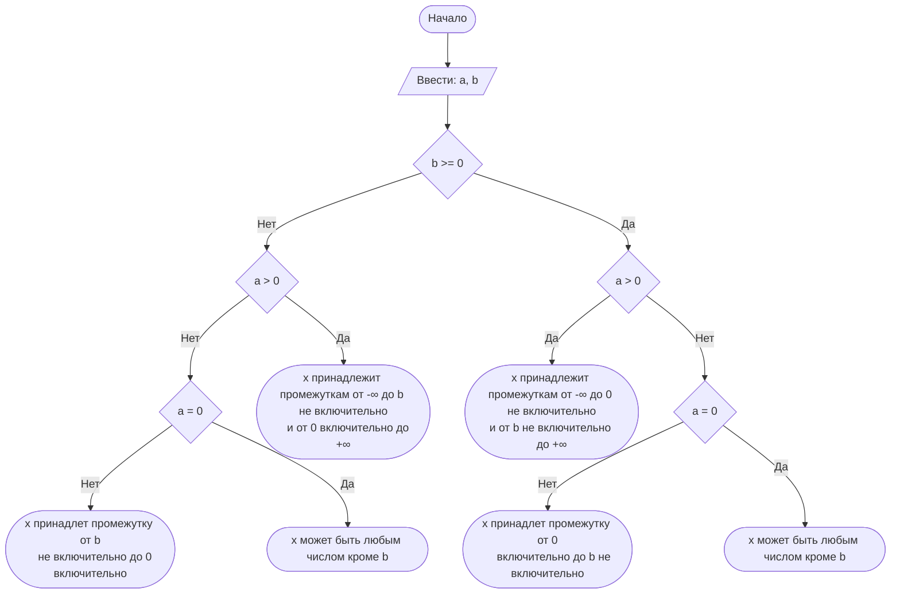

## Отчет по лабораторной работе № 1

#### № группы: `ПМ-2501`

#### Выполнил: `Замиралов Григорий Олегович`

#### Вариант: `8`

### Cодержание:

- [Постановка задачи](#1-постановка-задачи)
- [Входные и выходные данные](#2-входные-и-выходные-данные)
- [Математическая модель](#25-математическая-модель)
- [Выбор структуры данных](#3-выбор-структуры-данных)
- [Алгоритм](#4-алгоритм)
- [Программа](#5-программа)
- [Анализ правильности решения](#6-анализ-правильности-решения)

### 1. Постановка задачи
>Дано неравенство:
>
>$$a \cdot \frac{x}{x-b} \geq 0$$
>
>Где a и b — параметры (вводятся с клавиатуры). Решите его для x.
>
- Для решения данной задачи нужно упростить неравенство, чтобы получить неупрощаемую дробь сравнимую с `0`
  для этого нужно сравнить с нулём значения переменных `a` и `b`,
  чтобы впоследствии можно было упростить неравенство и вывести ограничения.
 

### 2. Входные и выходные данные
На вход программа должна получать 2 числа, при этом в условии не сказано, к какому множеству
принадлежат получаемые числа, поэтому будем считать их вещественными. Также верхняя и нижняя границы чисел ограниченны только используемым типом

|             | Тип                | min значение    | max значение   |
|-------------|--------------------|-----------------|----------------|
| a (Число 1) | Вещественное число |  4,9e-324       |  1,8e+308      |
| b (Число 2) | Вещественное число |  4,9e-324       |  1,8e+308      |

На выход подаётся:
- цепочка действий, приводящая к диапазону значений, являющихся решением неравенства;

### 2,5. Математическая модель

$$a \cdot \frac{x}{x-b} \geq 0$$

### 3. Выбор структуры данных

Для решения поставленной задачи достаточно хранить данные в переменных, не используя сложных структур;
|             | название переменной | Тип (в Java) | 
|-------------|---------------------|--------------|
| a (Число 1) | `a`                 | `double`     |
| b (Число 2) | `b`                 | `double`     | 

### 4. Алгоритм

1. **Ввод данных:**
   Программа считывает два вещественных числа, обозначенные как `a` и `b`.
2. **Сравнение `b` с `0`:**
   Сравниваем `b` чтобы обозначить знак в знаменателе неравенствою
3. **Вывод ограничений:**
   Ограничение для знаменателя, не допускаем равенство `x` и `b`.
4. **Сравнение `a` с `0`:**
   Сравниваем переменную `a` чтобы впоследствие поделить обе части неравенства на `a`, если
   переменная равна `0`, то получаем ответ, которым является промежуток, исключающий значение     переменной `b`, чтобы не допустить деление на `0`.
5. **Вывод результата:**
   С помощью метода интервалов устно получаем решение неравенства, исключаем вышеупомянутые       ограничения, получаем постоянный промежуток, подставляем в него значение переменной `b`, выводим на экран



    

### 5. Программа

```java
import java.io.PrintStream;
import java.util.Scanner;
public class Main {
    public static Scanner in = new Scanner(System.in); //для ввода параметров с клавиатуры
    public static PrintStream out = System.out; //для удобного вывода
    public static void main(String[] args) {
        out.print("Введите параметр a: ");
        double a = in.nextDouble(); //ввод параметра а
        out.print("Введите параметр b: ");
        double b = in.nextDouble(); //ввод параметра b
        if (b>=0) {
            out.println("Решим неравенство:" + a + "*" + "x" + "/" + "(x-" + b + ")" + ">=0"); //подставляем параметры в неравенство
            out.println("Ограничение: x ≠ " + b); // знаменатель не может быть равен 0
            if (a>0) {
                out.println("x/(x-" + b + ")" + ">=0"); //поделим обе части неравенства на 'a'
                if (b!=0) // частный случай для 'b' = 0, исключим ноль из области значений 'x'
                    out.println("x ∈ (-∞;" + "0" + "]∪(" + b + ";+∞)"); // получим ответ, воспользовавшись методом интервалов
                else
                    out.println("x ∈ (-∞;" + "0" + ")∪(" + "0" + ";+∞)"); // получим ответ, воспользовавшись методом интервалов
            }
            else {
                if (a == 0 || a == 0.0)
                    out.println("x ∈ (-∞;" + b + ")∪(" + b + ";+∞)"); //частный случай для 'a' = 0
                else {
                    out.println("x/(x-" + b + ")" + "<=0"); //поделим обе части неравенства на 'a'
                    if (b!=0)
                        out.println("x ∈ [0;" + b + ")"); // получим ответ, воспользовавшись методом интервалов
                    else
                        out.println("Нет решений!");
                }
            }
        }
        else {
            out.println("Решим неравенство:" + a + "*" + "x" + "/" + "(x+" + -b + ")" + ">=0"); //подставляем параметры в неравенство
            out.println("Ограничение: x ≠ " + b); // знаменатель не может быть равен 0
            if (a>0) {
                out.println("x/(x+" + -b + ")" + ">=0"); //поделим обе части неравенства на 'a'
                out.println("x ∈ (-∞;" + b + ")∪[" + "0" + ";+∞)"); // получим ответ, воспользовавшись методом интервалов
            }
            else {
                if (a == 0 || a == 0.0)
                    out.println("x ∈ (-∞;" + b + ")∪(" + b + ";+∞)"); //частный случай для 'a' = 0
                else {
                    out.println("x/(x+" + -b + ")" + "<=0"); //поделим обе части неравенства на 'a'
                    out.println("x ∈ (" + b + ";0]"); // получим ответ, воспользовавшись методом интервалов
                }
            }
        }
            }
        }
```

### 6. Анализ правильности решения
1. Тест на `a > 0; b > 0`:

    - **Input**:
        ```
        4 8
        ```

    - **Output**:
        ```
        x ∈ (-∞;0]∪(8.0;+∞)
        ```

2. Тест на `a > 0; b < 0`:

    - **Input**:
        ```
        5 -8
        ```

    - **Output**:
        ```
        x ∈ (-∞;-8.0)∪[0;+∞)
        ```

3. Тест на `a > 0; b = 0`:

    - **Input**:
        ```
        6 0
        ```

    - **Output**:
        ```
        x ∈ (-∞;0)∪(0;+∞)
        ```

4. Тест на `a = 0; b = 0`:

    - **Input**:
        ```
        0 0
        ```

    - **Output**:
        ```
        x ∈ (-∞;0.0)∪(0.0;+∞)

        ```
5. Тест на `a < 0; b = 0`:

    - **Input**:
        ```
        -4 0
        ```

    - **Output**:
        ```
        Нет решений!

        ```
6. Тест на `a < 0; b < 0`:

    - **Input**:
        ```
        -5 -9
        ```

    - **Output**:
        ```
       x ∈ (-9.0;0]

        ```
7. Тест на `a < 0; b > 0`:

    - **Input**:
        ```
        -9 5
        ```

    - **Output**:
        ```
        x ∈ [0;5.0)

        ```

