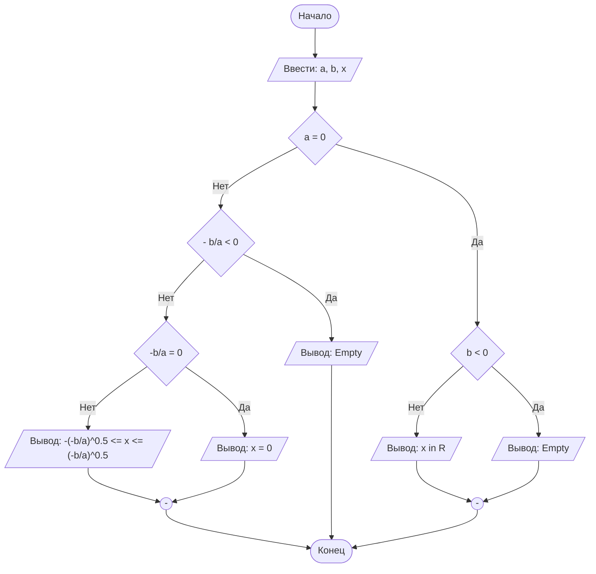

## Отчет по лабораторной работе № 1

#### № группы: `ПМ-2501`

#### Выполнил: `Замиралов Григорий Олегович`

#### Вариант: `8`

### Cодержание:

- [Постановка задачи](#1-постановка-задачи)
- [Входные и выходные данные](#2-входные-и-выходные-данные)
- [Математическая модель](#25-математическая-модель)
- [Выбор структуры данных](#3-выбор-структуры-данных)
- [Алгоритм](#4-алгоритм)
- [Программа](#5-программа)
- [Анализ правильности решения](#6-анализ-правильности-решения)

### 1. Постановка задачи
Дано неравенство:

$$a \cdot \frac{x}{x-b} \geq 0$$

Где a и b — параметры (вводятся с клавиатуры). Решите его для x.

- Подробное описание, как Вы понимаете, того, что вам нужно сделать. Можно с примерами

### 2. Входные и выходные данные
На вход подаются:
- две переменные типа double;
- диапазон значений от 4,9e-324 до 1,8e+308;

На выход подаётся:
- цепочка действий, приводящая к диапазону значений, являющимися решением неравенства;

### 2,5. Математическая модель

$$a \cdot \frac{x}{x-b} \geq 0$$

### 3. Выбор структуры данных

Для решения поставленной задачи достаточно хранить данные в переменных, не используя сложных структур;

### 4. Алгоритм

На русском языке подробно расписать, что и в каком порядке делает Ваша программа.

В 1 лабораторной работе блок-схем обязательна. Ниже представлен пример с лекции,
реализованный с помощью `mermaid` - инструментом для рисования диаграмм и блок-схем.

```markdown
    ```mermaid
        ([Начало]) --> B[/Ввести: a, b, x/]
        B --> C{a = 0}
        C -- Нет --> D{- b/a < 0}
        D -- Нет --> E{"-b/a = 0"}
        E -- Нет --> F[/"Вывод: -(-b/a)^0.5 <= x <= (-b/a)^0.5"/]
        E -- Да --> G[/Вывод: x = 0/]
        D -- Да --> H[/Вывод: Empty/]
        C -- Да --> I{b < 0}
        I -- Нет --> J[/Вывод: x in R/]
        I -- Да --> K[/Вывод: Empty/]
        J --> M(("-"))
        K --> M
        G --> L(("-"))
        H ----> Z
        F --> L
        M --> Z
        L --> Z([Конец])
    ``` 
```




`Mermaid` нативно интегрирован в `GitHub`, а для работы в Вашей среде разработке - нужно установить
плагин: `File` > `Settings` > `Plugins`.


### 5. Программа
```markdown
    ```java
import java.io.PrintStream;
import java.util.Scanner;
public class Main {
    public static Scanner in = new Scanner(System.in); //для ввода параметров с клавиатуры
    public static PrintStream out = System.out; //для удобного вывода
    public static void main(String[] args) {
        out.print("Введите параметр a: ");
        double a = in.nextDouble(); //ввод параметра а
        out.print("Введите параметр b: ");
        double b = in.nextDouble(); //ввод параметра b
        if (b>=0) {
            out.println("Решим неравенство:" + a + "*" + "x" + "/" + "(x-" + b + ")" + ">=0"); //подставляем параметры в неравенство
            out.println("Ограничение: x ≠ " + b); // знаменатель не может быть равен 0
            if (a>0) {
                out.println("x/(x-" + b + ")" + ">=0"); //поделим обе части неравенства на 'a'
                if (b!=0) // частный случай для 'b' = 0, исключим ноль из области значений 'x'
                    out.println("x ∈ (-∞;" + "0" + "]∪(" + b + ";+∞)"); // получим ответ, воспользовавшись методом интервалов
                else
                    out.println("x ∈ (-∞;" + "0" + ")∪(" + "0" + ";+∞)"); // получим ответ, воспользовавшись методом интервалов
            }
            else {
                if (a == 0 || a == 0.0)
                    out.println("x ∈ (-∞;" + b + ")∪(" + b + ";+∞)"); //частный случай для 'a' = 0
                else {
                    out.println("x/(x-" + b + ")" + "<=0"); //поделим обе части неравенства на 'a'
                    if (b!=0)
                        out.println("x ∈ [0;" + b + ")"); // получим ответ, воспользовавшись методом интервалов
                    else
                        out.println("Нет решений!");
                }
            }
        }
        else {
            out.println("Решим неравенство:" + a + "*" + "x" + "/" + "(x+" + -b + ")" + ">=0"); //подставляем параметры в неравенство
            out.println("Ограничение: x ≠ " + b); // знаменатель не может быть равен 0
            if (a>0) {
                out.println("x/(x+" + -b + ")" + ">=0"); //поделим обе части неравенства на 'a'
                out.println("x ∈ (-∞;" + b + ")∪[" + "0" + ";+∞)"); // получим ответ, воспользовавшись методом интервалов
            }
            else {
                if (a == 0 || a == 0.0)
                    out.println("x ∈ (-∞;" + b + ")∪(" + b + ";+∞)"); //частный случай для 'a' = 0
                else {
                    out.println("x/(x+" + -b + ")" + "<=0"); //поделим обе части неравенства на 'a'
                    out.println("x ∈ (" + b + ";0]"); // получим ответ, воспользовавшись методом интервалов
                }
            }
        }
            }
        }

     ```

```

### 6. Анализ правильности решения

Привести тесты и анализ работы программы для этих тестов.
Очень неплохо было бы обосновать выбор тестов.

1. Тест на что-то

- Input:
    ```
    1
    1
    ```

- Output:
    ```
    2
    ```

2. Тест на что-то еще

- Input:
    ```
    1
    -1
    ```

- Output:
    ```
    0
    ```

# Критерии оценивания

Обратите внимание на то, что лабораторная работа должна быть выложена в отдельный репозиторий с названием LabN (N -
Номер лабы). В репозитории должно быть минимум 2 файла (README.md - отчет, Main.java - код лабы)

| **Критерий**                                                                                                                                                                           | **Баллы**       |
|----------------------------------------------------------------------------------------------------------------------------------------------------------------------------------------|-----------------|
| **Корректность программы**                                                                                                                                                             | **0** - **40**  |
| - Программа полностью выполняет задачу                                                                                                                                                 | 15              |
| - Нет ошибок выполнения                                                                                                                                                                | 10              |
| - Учтены все ограничения                                                                                                                                                               | 5               |
| - Правильное поведение в "крайних" случаях                                                                                                                                             | 10              |
|                                                                                                                                                                                        |                 |
| **Оптимизация кода**                                                                                                                                                                   | **0** - **20**  |
| - Эффективные алгоритмы                                                                                                                                                                | 10              |
| - Избежание избыточности и повторов                                                                                                                                                    | 5               |
| - Разумность использования структур данных                                                                                                                                             | 5               |
|                                                                                                                                                                                        |                 |
| **Читабельность и стиль кода**                                                                                                                                                         | **0** - **20**  |
| - Соблюдение стандартов форматирования                                                                                                                                                 | 5               |
| - Наличие комментариев, в полном объеме поясняющих написанный код                                                                                                                      | 10              |
| - Понятные имена переменных и функций                                                                                                                                                  | 5               |
|                                                                                                                                                                                        |                 |
| **Оформление отчета**                                                                                                                                                                  | **0** - **20**  |
| - Соблюдение структуры отчета                                                                                                                                                          | 5               |
| - Отчет загружен на GitHub в репозиторий с названием LabN (N - номер лабораторной работы), отчет в формате Markdown с названием README.md, также есть файл Main.java с кодом программы | Обязательно     |
| - Четкое описание алгоритма (блок-схема если нужна)                                                                                                                                    | 5               |
| - Полнота покрытия тестами всех случаев                                                                                                                                                | 5               |
| - Обоснования использования алгоритма, структур данных                                                                                                                                 | 5               |
|                                                                                                                                                                                        |                 |
| **Общая сумма**                                                                                                                                                                        | **0** - **100** |
                                              
